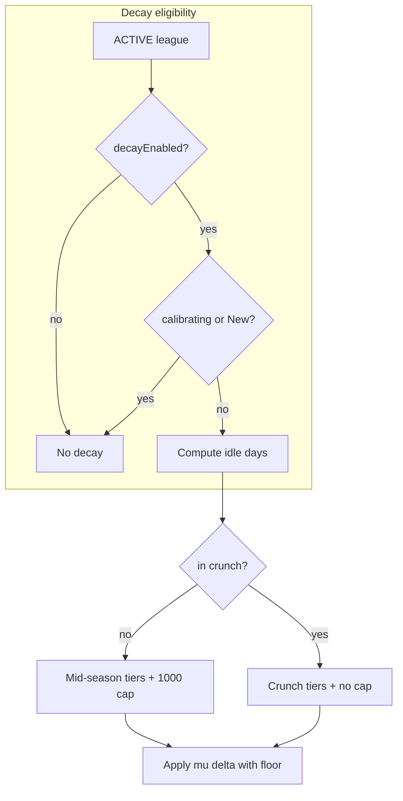

# Rating decay — Design

**Date:** 2026-08-23  
**Status:** Approved for implementation  
**Scope:** `general` (league-scoped idle decay + end-of-season crunch; not game-specific)  
**Plan:** [`docs/superpowers/plans/2026-08-23-rating-decay.md`](../plans/2026-08-23-rating-decay.md)  
**Related:** [`2026-08-19-league-rollover-design.md`](./2026-08-19-league-rollover-design.md), [`2026-08-22-new-player-rating-isolation-design.md`](./2026-08-22-new-player-rating-isolation-design.md), [`2026-08-17-calibrating-ki-display-design.md`](./2026-08-17-calibrating-ki-display-design.md), `.cursor/rules/openskill-rating.mdc`

## Goal

Keep league leaderboards and lobby balance honest when players stop playing:

1. **Mid-season decay** — after an idle grace period, league-global μ erodes so inactive players appear weaker in win% / balance until they finish a real game again.
2. **End-of-season crunch** — in the last ~7 days before season end, shorter grace, faster decay, and no streak cap so top players cannot freeze the board.
3. **Prize lock** — during crunch, 🥇🥈🥉 medal slots skip players who have not finished a completed non-quit game in the last **7 days** of the season; ki rank on `/rank` is unchanged.

Decay is a **real μ change** on `PlayerRating` only (not display-only, not hero ratings).

## Non-goals (v1)

- Hero rating decay (`PlayerHeroRating`)
- Display-only / cosmetic ki erosion without changing μ
- Last-week ki bonus (+50–100% gains on crunch-week games)
- Auto season naming or scheduled auto-rollover
- Decay on **archived** leagues
- Retroactive decay on past seasons or pre-migration history
- Configurable per-league decay rates (fixed constants in code)
- Tunable prize-lock N via config (fixed **7 days**)
- Web dashboard / export for decay audit
- New env vars or AWS SSM keys (constants in code only)

## Locked decisions

| Topic                    | Choice                                                                                                                                               |
| ------------------------ | ---------------------------------------------------------------------------------------------------------------------------------------------------- |
| Decay target             | **League-global** `PlayerRating.mu` only; σ unchanged                                                                                                |
| Activity definition      | Latest **completed, non-quit** match: `Match.status = COMPLETED`, `MatchPlayer.isQuitter = false`; uses `Match.completedAt`                          |
| Streak reset             | One qualifying completed non-quit game resets idle streak and `idleDecayKiApplied`                                                                   |
| Lobby join               | Does **not** count as activity                                                                                                                       |
| Mid-season grace         | **10 days** idle before decay starts                                                                                                                 |
| Mid-season tiers         | Days 11–19: **−50 ki/day**; day 20+: **−100 ki/day**                                                                                                 |
| Mid-season streak cap    | **−1000 ki** total per idle streak (not lifetime); then no further decay until reset                                                                 |
| Ki floor                 | Do not decay below **~1000 ki** (`μ ≥ z(games) × σ` using display z blend)                                                                           |
| Exempt players           | Calibrating (`leagueGames < 5`), **`isNewPlayer`**, missing global row                                                                               |
| Exempt leagues           | **`ARCHIVED`**; **`decayEnabled = false`**                                                                                                           |
| Break / continue leagues | **`decayEnabled = false`** on `reset:continue` successor; staff may re-enable via `/config set decay`                                                |
| Crunch trigger           | **Both** optional `seasonEndsAt` (auto crunch 7 days before) and `/league crunch start` (manual / early)                                             |
| Crunch grace             | **2 days** idle before crunch decay                                                                                                                  |
| Crunch tiers             | Days 3–9: **−100 ki/day**; day 10+: **−200 ki/day** (2× mid-season rates)                                                                            |
| Crunch streak cap        | **None** (floor still applies)                                                                                                                       |
| Prize lock               | **Yes** during crunch only                                                                                                                           |
| Prize lock N             | **7 days** before season end anchor                                                                                                                  |
| Prize lock scope         | Live leaderboard + `/leaderboard show` overall; **`/rank` unchanged**                                                                                |
| Medal UX                 | Board competition rank `#n` unchanged; medals assigned to first three **eligible** players by ki order (🥇 may appear on `#2` if `#1` is ineligible) |
| Execution model          | **Daily UTC batch** + **catch-up on μ read** (shared pure math)                                                                                      |
| Rank reset               | Reset `idleDecayKiApplied` and `lastDecayAppliedAt`; keep match-derived `lastQualifyingActivityAt`                                                   |
| Language                 | English user-facing strings                                                                                                                          |

## Decay math

Public ki (display only, unchanged formula):

```text
ki = round(1000 + 200 × (μ − z·σ))
```

Constants from [`rating-math.ts`](../../src/services/rating/rating-math.ts): `KI_OFFSET = 1000`, `KI_SCALE = 200`, z blends 3 → 2.5 over first 5 games.

### μ conversion

Daily ki loss maps to μ erosion:

```text
Δμ = −Δki / KI_SCALE
```

Examples: −50 ki/day → −0.25 μ/day; −100 ki/day → −0.5 μ/day.

### Floor

Before applying decay for a UTC day, compute:

```text
μ_floor = displayConservatismZ(leagueGames) × σ
```

Do not reduce μ below `μ_floor` (equivalent to public ki ≥ ~1000 for that player’s z and σ).

σ is **never** changed by decay.

### Idle day counting

- All calendar math in **UTC**.
- **Idle days** = whole UTC days since `lastQualifyingActivityAt`. If null, player is exempt (no decay).
- Apply **at most one day’s decay per UTC day** per player (`lastDecayAppliedAt` guard).

### Mid-season rules (`decayEnabled` and not in crunch)

| Idle days since last qualifying activity | Daily ki loss                                                        |
| ---------------------------------------- | -------------------------------------------------------------------- |
| 0–10                                     | 0                                                                    |
| 11–19                                    | −50                                                                  |
| 20+                                      | −100                                                                 |
| Streak cap                               | Stop after **1000 ki** lost in current streak (`idleDecayKiApplied`) |

### Crunch rules

**Crunch active** when league is `ACTIVE`, `decayEnabled`, and:

```text
now >= seasonEndsAt − 7 days
OR
(crunchStartedAt IS NOT NULL AND now >= crunchStartedAt AND league not archived)
```

**Crunch period start** (`crunchStart`):

```text
crunchStart = min(
  seasonEndsAt − 7 days   (if seasonEndsAt set),
  crunchStartedAt         (if manual start and earlier)
)
```

When only `seasonEndsAt` is set, crunch runs `[seasonEndsAt − 7d, seasonEndsAt)`.

When only manual crunch is set (no `seasonEndsAt`), crunch runs from `crunchStartedAt` until rollover archives the league or staff runs `/league crunch clear` (if auto crunch not also active).

When both are set and manual starts early, use the **earlier** start; end at `seasonEndsAt` unless league is archived first.

| Idle days (same activity definition) | Daily ki loss          |
| ------------------------------------ | ---------------------- |
| 0–2                                  | 0                      |
| 3–9                                  | −100                   |
| 10+                                  | −200                   |
| Streak cap                           | **None** during crunch |

While in crunch, crunch tier rules **replace** mid-season tiers (not stacked).



## Prize lock (crunch only)

**Season end anchor:**

```text
seasonEndAnchor = seasonEndsAt ?? league.archivedAt (at rollover time)
```

During crunch, player is **prize-eligible** when:

```text
lastQualifyingActivityAt >= seasonEndAnchor − 7 days   (when seasonEndsAt is set)
lastQualifyingActivityAt >= crunchStart               (manual crunch only, no seasonEndsAt)
```

For a standard 7-day crunch aligned to `seasonEndsAt`, the first rule equals “played at least once during crunch.”

**Leaderboard behavior (overall only, when crunch active):**

1. Sort and assign competition ranks by ki as today.
2. Walk sorted list; assign 🥇, 🥈, 🥉 to the **first three prize-eligible** players.
3. Ineligible players keep numeric board rank (`#n`) with **no** medal prefix.
4. Add embed footnote: _"Medals require a completed game in the last 7 days of the season."_

**`/rank`:** always shows true ki and competition rank — no prize filtering.

**Hero leaderboards:** no prize lock in v1.

**Archived leagues:** no prize lock (historical boards unchanged).

## When decay runs

### Approach (locked): daily batch + read catch-up

| Path                 | When                                                                     | Scope                                                                                               |
| -------------------- | ------------------------------------------------------------------------ | --------------------------------------------------------------------------------------------------- |
| **Daily batch**      | Once per UTC day (scheduler on bot start, same pattern as match cleanup) | All eligible `PlayerRating` rows in ACTIVE leagues with `decayEnabled`                              |
| **Catch-up on read** | Before any code path uses μ for balance, preview, `/rank`, leaderboard   | `(leagueId, playerId)` being read; for lobby preview, all roster participants                       |
| **Match apply hook** | After rating apply on COMPLETED match                                    | Reset streak for non-quit participants; update `lastQualifyingActivityAt`; refresh live leaderboard |

Shared pure function (unit-tested):

```text
computeDecayDelta({
  idleDays,
  inCrunch,
  streakKiApplied,
  mu,
  sigma,
  leagueGames,
  utcDaysToApply,
}) → { muDelta, streakKiApplied, lastDecayAppliedThrough }
```

`applyPendingDecay(leagueId, playerId, db?)` loads league + rating + game count, computes pending UTC days since `lastDecayAppliedAt`, calls pure math, persists μ and counters in one update.

Idempotency: re-running for the same UTC day applies zero additional decay.

## Data model

### `League` columns

```prisma
decayEnabled    Boolean   @default(true)
seasonEndsAt    DateTime?
crunchStartedAt DateTime?
```

| Field             | Meaning                                               |
| ----------------- | ----------------------------------------------------- |
| `decayEnabled`    | Master switch; `false` on continue rollover successor |
| `seasonEndsAt`    | Optional season end; auto crunch from T−7d            |
| `crunchStartedAt` | Manual / early crunch start                           |

**Rollover config copy:** copy all three fields to successor on continue (with `decayEnabled = false` forced for continue mode). For hard/soft, copy values but default `decayEnabled = true` if absent on source.

### `PlayerRating` columns

```prisma
lastQualifyingActivityAt DateTime?
idleDecayKiApplied       Int       @default(0)
lastDecayAppliedAt       DateTime?
```

| Field                      | Meaning                                                  |
| -------------------------- | -------------------------------------------------------- |
| `lastQualifyingActivityAt` | Latest non-quit COMPLETED match `completedAt`            |
| `idleDecayKiApplied`       | Ki lost in current idle streak (mid-season cap tracker)  |
| `lastDecayAppliedAt`       | UTC timestamp through which daily decay has been applied |

**Continue:** copy all decay fields with μ/σ (same as rating copy).

**Soft:** copy decay fields from source rows being seeded (same player set as rating seed).

**Hard:** seed `idleDecayKiApplied = 0`, `lastQualifyingActivityAt = null`, `lastDecayAppliedAt = null` for every carried player (fresh idle tracking on the new league).

### Migration / backfill

1. Prisma migration adding columns with defaults.
2. Backfill `League.decayEnabled = true` for existing ACTIVE leagues.
3. Backfill `PlayerRating.lastQualifyingActivityAt`:

```sql
SELECT mp."playerId", m."leagueId", MAX(m."completedAt")
FROM "MatchPlayer" mp
JOIN "Match" m ON m.id = mp."matchId"
WHERE m.status = 'COMPLETED'
  AND mp."isQuitter" = false
  AND m."completedAt" IS NOT NULL
GROUP BY mp."playerId", m."leagueId"
```

4. Leave `idleDecayKiApplied = 0`, `lastDecayAppliedAt = null` on backfill (no retroactive decay).

## Match completion integration

On rating apply for a COMPLETED match, for each participant:

| Participant | Update                                                                                                        |
| ----------- | ------------------------------------------------------------------------------------------------------------- |
| Non-quit    | Set `lastQualifyingActivityAt = match.completedAt`; `idleDecayKiApplied = 0`; set `lastDecayAppliedAt = null` |
| Quitter     | Do **not** update activity or reset streak                                                                    |

Activity update runs even when team `rate()` was skipped (New freeze) — a completed non-quit game still resets idle decay.

## Rank reset integration

In existing wipe transaction ([`rank-reset.ts`](../../src/services/rating/rank-reset.ts)):

- Set `idleDecayKiApplied = 0`
- Set `lastDecayAppliedAt = null`
- **Do not** clear `lastQualifyingActivityAt` (match history unchanged; reset does not grant decay immunity beyond calibrating/New exempt window)

Player becomes calibrating again → exempt from decay until 5 games.

## Commands

Auth for league admin subcommands: `assertCanConfigureBot` (same as `/league rollover`).

### `/league set season_end`

| Option   | Type                                     | Notes                                                   |
| -------- | ---------------------------------------- | ------------------------------------------------------- |
| `date`   | string (ISO date or Discord date parser) | Required; stored as UTC end-of-day or explicit datetime |
| `league` | autocomplete                             | When guild has multiple ACTIVE leagues                  |

Sets `seasonEndsAt`. Reject on archived league. Ephemeral success with crunch auto-start note (7 days before).

### `/league clear season_end`

Clears `seasonEndsAt`. Auto crunch from date removed; manual `crunchStartedAt` unchanged.

### `/league crunch start`

Sets `crunchStartedAt = now()` if not already in crunch from this field. Ephemeral confirm if already started (idempotent OK with “already in crunch” message).

### `/league crunch clear`

Clears `crunchStartedAt` only. If `seasonEndsAt` still implies auto crunch window, crunch may remain active from date.

### `/config set decay`

| Option    | Type            | Notes                               |
| --------- | --------------- | ----------------------------------- |
| `enabled` | boolean         | Required                            |
| `league`  | existing option | Same resolve as other league config |

Auth: `assertCanConfigureBot`. Reject on archived league.

### `/config view`

Add lines e.g.:

```text
**Rating decay:** `on` · season ends <t:UNIX:F> · crunch active
**Rating decay:** `off` (break league default)
```

### `/league list` (optional v1 enhancement)

Show decay off + season end on active league lines when set — **nice-to-have**; not blocking.

## Module layout

| Path                                            | Responsibility                                                                     |
| ----------------------------------------------- | ---------------------------------------------------------------------------------- |
| `src/services/rating/rating-decay.ts`           | Pure math, eligibility, `applyPendingDecay`, batch apply, prize eligibility helper |
| `src/services/rating/rating-decay.test.ts`      | Unit tests                                                                         |
| `src/services/rating/rating-decay-scheduler.ts` | Daily UTC scheduler; start/stop from ready                                         |
| `src/services/rating/rating-preview.ts`         | Call catch-up before μ reads                                                       |
| `src/services/rating/rating-update.ts`          | Activity + streak reset on match apply                                             |
| `src/services/rating/rank-reset.ts`             | Reset decay counters on wipe                                                       |
| `src/services/league/league-rollover.ts`        | `decayEnabled = false` on continue; copy decay fields                              |
| `src/services/leaderboard/leaderboard.ts`       | Prize eligibility flag on entries during crunch                                    |
| `src/services/leaderboard/leaderboard-embed.ts` | Medal assignment + footnote                                                        |
| `src/commands/league/league.ts`                 | `set season_end`, `clear season_end`, `crunch start`, `crunch clear`               |
| `src/commands/config/config.ts`                 | `decay` set/view                                                                   |
| `src/events/ready.ts`                           | Start decay scheduler                                                              |

Keep Discord I/O thin; all rules in rating-decay service (shared-domain-logic).

## Edge cases

| Case                                 | Rule                                                                                                                           |
| ------------------------------------ | ------------------------------------------------------------------------------------------------------------------------------ |
| **Calibrating**                      | No decay while `leagueGames < 5`                                                                                               |
| **New player**                       | No decay while `isNewPlayer`                                                                                                   |
| **Quitter finish**                   | Does not reset streak; decay still applies if otherwise eligible                                                               |
| **Continue league (1.5)**            | `decayEnabled = false` until staff enable                                                                                      |
| **Rollover during crunch**           | Archive stops decay and prize lock; successor seeding copies decay fields on continue                                          |
| **Match correction / re-rate**       | Activity from `completedAt`; no automatic decay reversal                                                                       |
| **Hero-only player (no global row)** | Skip decay (unchanged edge case)                                                                                               |
| **No qualifying activity yet**       | Exempt from decay until `lastQualifyingActivityAt` is set by first non-quit COMPLETED match                                    |
| **Partial UTC day**                  | At most one tier application per UTC day                                                                                       |
| **Crunch ends without rollover**     | When `now >= seasonEndsAt`, decay continues under mid-season rules unless league archived                                      |
| **Manual crunch without season end** | Prize eligibility = `lastQualifyingActivityAt >= crunchStart`; decay uses crunch tiers until archive or `/league crunch clear` |

## Error messages (English)

| Case                     | Message                                                          |
| ------------------------ | ---------------------------------------------------------------- |
| Write to archived league | `That league is archived. Pick an active league.`                |
| Invalid season end date  | `Could not parse that date. Use YYYY-MM-DD or a full date/time.` |
| Season end in the past   | `Season end must be in the future.`                              |

## Player-facing copy

| Surface                                              | Copy                                                                                                  |
| ---------------------------------------------------- | ----------------------------------------------------------------------------------------------------- |
| `/rank` footer (idle > 10d, not in crunch, decay on) | _Inactive 11+ days: league ki decays −50/day (−100/day after 20 days) until you finish a game._       |
| Live leaderboard crunch banner                       | _Season crunch — play this week to keep your medal spot._                                             |
| Crunch decay hint (optional `/rank` when in crunch)  | _Crunch week: −100 ki/day after 2 idle days (−200/day after 10)._                                     |
| Staff guide                                          | When to set `season_end`, continue leagues default decay off, `/league crunch start` for early crunch |

## Testing

### Unit (`rating-decay.test.ts`)

- Mid-season tiers at days 10, 11, 19, 20, 30
- Streak cap stops at 1000 ki mid-season; resets on qualifying game
- Crunch tiers at days 2, 3, 9, 10; no cap in crunch
- Floor: veteran σ/z does not go below ~1000 ki
- μ ↔ ki mapping (`Δμ = −Δki/200`)
- Crunch detection with `seasonEndsAt`, manual start, both
- Prize eligibility window (7 days)
- Idempotency: same UTC day twice → zero additional decay
- Exempt: calibrating, New, `decayEnabled false`

### Integration-light

- Catch-up before lobby `predictWin` changes blended μ
- Match apply resets streak for non-quit only
- Continue rollover sets `decayEnabled = false`
- Leaderboard: ineligible #1 has `#1` without medal; #2 gets 🥇
- Archived league: batch no-op
- Rank reset clears `idleDecayKiApplied`

## Documentation deliverables

| File                                         | Audience                                 |
| -------------------------------------------- | ---------------------------------------- |
| `docs/discord/staff/a7-rating-decay.md`      | Staff — season end, crunch, decay toggle |
| `docs/discord/staff/a5-admin-cheat-sheet.md` | Staff — one-line entries                 |
| `docs/discord/public/06-rank-and-boards.md`  | Players — idle decay + crunch medals     |
| `docs/discord/README.md`                     | Index — add `a7`                         |
| `.cursor/rules/openskill-rating.mdc`         | Agent — decay edge-case row              |

## Migration / rollout

1. Deploy migration + backfill (no retroactive μ change).
2. Enable scheduler on bot restart.
3. Post staff guide; announce crunch/prize lock before first season end.
4. Continue rollovers automatically get decay off — staff opt in if desired.

## Follow-ups (out of scope)

- Configurable decay rates / grace via `/config`
- Prize lock on hero boards
- Decay audit log table
- `/rank` prize-eligible indicator during crunch
- Auto-disable decay when `seasonEndsAt` cleared mid-crunch notification to players
- Exclude decayed players from win-streak leaderboard semantics
