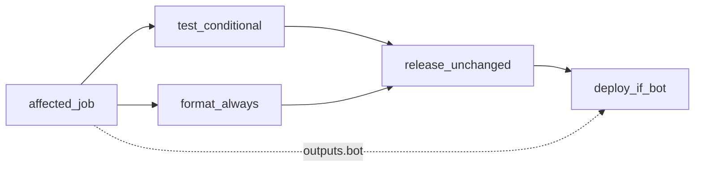

# Affected Turbo CI — Design

**Date:** 2026-09-21  
**Status:** Approved  
**Scope:** `general` (CI only; not game- or league-specific)  
**Extends:** `docs/superpowers/specs/2026-08-14-github-actions-cicd-design.md`, `docs/superpowers/specs/2026-09-21-artifact-deploy-design.md`, `docs/superpowers/specs/2026-09-21-monorepo-web-base-design.md`

## Goal

Run Test (and EC2 Deploy) only for packages affected by the change set, using Turborepo’s dependency graph the same way NX `affected` does. Web-only pushes must not run bot typecheck/test or ship a bot artifact to EC2. Changes to shared packages (e.g. `@dbz/db`) must pull in dependents (e.g. `@dbz/bot`).

## Non-goals

- Changing semantic-release (still single-product version on `@dbz/bot` via `.releaserc.json`)
- Multi-package / independent web versioning
- Path-glob-only detection (`dorny/paths-filter`) as the primary mechanism
- Splitting into separate per-app workflows
- Filtering commit-analyzer so web commits never bump bot semver
- Vercel Remote Cache / paid Turbo SaaS

## Decisions (locked)

| Topic                  | Choice                                                           |
| ---------------------- | ---------------------------------------------------------------- |
| Detection              | Turbo graph: `turbo ls --filter="...[$BASE]" --output=json`      |
| Helper                 | `scripts/ci/affected.sh` → `bot` / `web` / `force_all` booleans  |
| Test                   | Conditionally run `@dbz/bot` typecheck/test and `@dbz/web` build |
| Deploy                 | Only when `bot`, `force_all`, or `workflow_dispatch`             |
| Release                | Unchanged — every successful `main` push after test + format     |
| format / commitlint    | Always                                                           |
| Root/tooling fail-safe | Diff touching listed paths → `force_all` (both packages)         |

### Force-all paths

- `pnpm-lock.yaml`
- Root `package.json`
- `turbo.json`
- `.github/workflows/**`
- `deploy/aws/**`

## Architecture

```text
PR / push / workflow_dispatch
  → affected job (full git history + pnpm install)
       scripts/ci/affected.sh → bot, web, force_all
  → test (needs affected): conditional Turbo tasks
  → format (always)
  → commitlint (PRs only, always)
  → release (main only, unchanged)
  → deploy (main / dispatch): only if bot || force_all || dispatch
```



### Base ref selection

| Event               | Base                                                                                 |
| ------------------- | ------------------------------------------------------------------------------------ |
| `pull_request`      | `origin/${{ github.base_ref }}`                                                      |
| `push`              | `github.event.before` when it is a 40-char non-zero SHA; else first parent of `HEAD` |
| `workflow_dispatch` | Skip graph; set `force_all=true`                                                     |

### Package graph today

- `@dbz/web` — no workspace deps
- `@dbz/bot` → `@dbz/db`
- Changing `@dbz/db` marks `@dbz/bot` affected via Turbo’s `...[base]` filter

### Test job behavior

| Flags                | Actions                                                                        |
| -------------------- | ------------------------------------------------------------------------------ |
| `bot` or `force_all` | `pnpm --filter @dbz/db generate`; `turbo run typecheck test --filter=@dbz/bot` |
| `web` or `force_all` | `turbo run build --filter=@dbz/web`                                            |
| neither              | No-op success (job green so `main` release can still run)                      |

### Deploy job behavior

Existing success gates remain (`test` success; on push, `release` success). Additional gate:

`bot == true || force_all == true || event_name == workflow_dispatch`

Pack → S3 → SSM path unchanged from the artifact-deploy design.

## Semantic-release (unchanged)

- Tag format `v${version}`; `pkgRoot: apps/bot`
- Assets: `CHANGELOG.md`, `apps/bot/package.json`, `pnpm-lock.yaml`
- Release commit includes `[skip ci]`

**Accepted trade-off:** A web-only conventional commit on `main` may still bump the bot version while EC2 deploy is skipped. That version ships on the next bot-affected (or forced) deploy.

## Error handling

| Failure                           | Result                                     |
| --------------------------------- | ------------------------------------------ |
| `affected.sh` cannot resolve base | Exit non-zero; pipeline fails closed       |
| Turbo ls fails                    | Exit non-zero                              |
| Neither package affected on PR    | Test succeeds; format/commitlint still run |
| Deploy gated off                  | Job skipped; no S3/SSM                     |

## Relationship to prior specs

| Spec                            | Relationship                                                         |
| ------------------------------- | -------------------------------------------------------------------- |
| 2026-08-14 GitHub Actions CI/CD | Adds affected gating for test/deploy; does not change SSM auth model |
| 2026-09-21 artifact deploy      | Deploy body unchanged; only the job `if:` gains bot/force_all        |
| 2026-09-21 monorepo web base    | Consumes workspace package names `@dbz/bot` / `@dbz/web` / `@dbz/db` |
| 2026-08-18 bot versioning       | semantic-release left as-is                                          |

## Testing (acceptance)

1. Web-only change vs base → `web=true`, `bot=false`; CI runs web build only; deploy skipped on `main`.
2. `packages/db` change → `bot=true`; bot typecheck/test run.
3. Bot-only change → `bot=true`, `web=false`.
4. Lockfile / workflow / `deploy/aws` change → `force_all=true`; both packages + deploy eligible.
5. `workflow_dispatch` → `force_all=true`; full test + deploy allowed.
