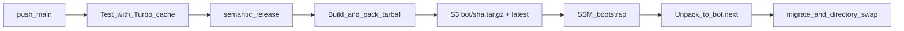

# Artifact deploy (S3 tarball) — Design

**Date:** 2026-09-21  
**Status:** Approved (portable release tree + S3 + host cutover)  
**Scope:** `general` (host deploy / CI; not game- or league-specific)  
**Extends:** `docs/superpowers/specs/2026-08-22-zero-downtime-deploy-design.md`, `docs/superpowers/specs/2026-08-14-github-actions-cicd-design.md`, `docs/superpowers/specs/2026-09-21-monorepo-web-base-design.md`

## Goal

Stop shipping the full git monorepo to production and stop building (`pnpm install` / `tsc`) on the t3.micro. CI builds a **portable Discord bot release tree**, uploads **one tarball** to S3, and the host downloads that artifact, unpacks to a stage directory, then keeps the existing short cutover (refresh-env → deploy-commands → stop → migrate → swap → start).

## Non-goals

- Docker / container registry
- GitHub Release assets as the runtime delivery path
- On-host `pnpm install` or `tsc` for deploys
- Running `prisma migrate deploy` from GitHub Actions against production
- Changing Vercel web deploy
- Overlapping two Node processes on the same Discord token
- Automatic swap-back if `systemctl start` fails after promote
- Vercel Remote Cache / paid Turbo SaaS (v1 uses GitHub Actions cache of `.turbo`)

## Decisions (locked)

| Topic           | Choice                                                                                           |
| --------------- | ------------------------------------------------------------------------------------------------ |
| Artifact shape  | Portable release tree (mirrors current `/home/ubuntu/bot` layout) in one `.tar.gz`               |
| Storage         | Private S3 bucket                                                                                |
| Object keys     | Immutable `bot/<GITHUB_SHA>.tar.gz` + `bot/latest` (copy of that object)                         |
| Updater scripts | Shipped **inside** the tarball (`deploy/aws/**`); SSM bootstraps by download → unpack → exec     |
| Host git        | Removed from the deploy hot path; no `git pull` for app or scripts                               |
| Build location  | GitHub Actions only                                                                              |
| Host cutover    | Keep stage dir + directory swap from zero-downtime design                                        |
| Prisma migrate  | On EC2, from **stage**, after stop, before swap — migrations + Prisma CLI in the tarball         |
| Turbo           | CI restores/saves `.turbo` via `actions/cache`; builds go through Turbo where applicable         |
| systemd paths   | Unchanged: `WorkingDirectory=/home/ubuntu/bot`, `ExecStart=/usr/bin/node apps/bot/dist/index.js` |

## Architecture

```text
push to main (after Test + Release)
  → CI: install → Turbo-cached build → pack-release → S3 put bot/<sha>.tar.gz + bot/latest
  → SSM (no git pull)
       1. aws s3 cp bot/latest → /tmp/bot-release.tar.gz
       2. unpack to /home/ubuntu/bot.next
       3. sudo bash bot.next/deploy/aws/host-update.sh   # artifact mode
            a. flock
            b. ensure-swap (optional; less critical without on-host install)
            c. refresh-env into bot.next/.env
            d. deploy-commands from stage (Discord API; bot process not required)
            e. systemctl stop dbz-bot
            f. prisma migrate deploy from stage (packages/db)
            g. mv bot → bot.prev; mv bot.next → bot
            h. systemctl start dbz-bot
            i. rm -rf bot.prev   # only if start succeeded
            j. touch /var/lib/dbz-bot/ready
```



### Why not migrate from Actions

Production DB credentials stay on the instance (SSM → `.env`). A failed migrate must pair with restarting the **old** tree. The old Prisma client must not talk to a schema it does not understand — stop, then migrate, then promote.

### Why ship Prisma CLI in the tarball

`@dbz/db` lists `prisma` as a **devDependency**. A production-only prune would omit the CLI and break `migrate:deploy` on the host. The pack script must include the Prisma CLI on the runtime path (promote for release packaging and/or vendor `node_modules/.bin/prisma` + package).

## Artifact contents

Extracted root becomes `/home/ubuntu/bot`:

| Path                                                                   | Purpose                                                                       |
| ---------------------------------------------------------------------- | ----------------------------------------------------------------------------- |
| `apps/bot/dist/**`                                                     | Runtime entry `apps/bot/dist/index.js` (+ compiled `deploy-commands` if used) |
| `apps/bot/package.json`                                                | Semver for changelog / observability                                          |
| `packages/db/prisma/**`                                                | Schema + migrations for `migrate deploy`                                      |
| Production `node_modules` (incl. `@dbz/db`, Prisma client **and CLI**) | No install on host                                                            |
| `CHANGELOG.md`                                                         | `readChangelogMarkdown` via monorepo root                                     |
| `docs/discord/**`                                                      | Staff/public Discord docs sync                                                |
| `deploy/aws/**`                                                        | `host-update.sh`, `refresh-env.sh`, `ensure-swap.sh`, unit file helpers       |
| `RELEASE.json`                                                         | `{ "sha", "builtAt" }` for host logs / sanity                                 |

Pack script lives in-repo (e.g. `deploy/aws/pack-release.sh` or `scripts/pack-bot-release.sh`): CI runs install → generate → Turbo build bot → assemble tree → `tar -czf`. Host never runs the packer.

Optional: use `pnpm --filter @dbz/bot deploy` inside the packer for dependency closure, then copy the extra root files listed above.

## S3 & IAM

- Terraform-managed private bucket (name via var / `local.name_prefix`).
- GitHub Actions deploy role: `s3:PutObject` (and related) on `bot/*`.
- EC2 instance role: `s3:GetObject` on `bot/*`.
- Optional lifecycle rule to expire old `bot/<sha>.tar.gz` objects (keep enough for manual rollback).
- GitHub Actions variable (or Terraform output → repo var): bucket name / URI prefix.

Manual rollback: re-point deploy at an older sha (`RELEASE_SHA=<old>` or temporarily copy that object to `bot/latest`) and re-run host-update. Schema rollback is **not** automatic if migrate already applied.

## Host updater changes

Rewrite [`deploy/aws/host-update.sh`](deploy/aws/host-update.sh) for **artifact mode**:

1. **SSM (or manual bootstrap) owns download + unpack** into `${APP_DIR}.next`. `host-update.sh` assumes that stage directory already exists and is a complete release tree; it does not call `git` or `aws s3 cp`.
2. Remove git fetch/clone/reset of the stage from the live clone.
3. Keep flock, leftover `bot.prev` handling, refresh-env into stage, stop → migrate → swap → start, ready marker.
4. `deploy-commands`: run compiled JS with `node` from the stage (no `tsx` / source tree required). Adjust package script or host-update invocation accordingly.
5. Migrate: from stage via `prisma migrate deploy` with schema under `packages/db` (packed tree may not be a full pnpm workspace; prefer invoking the vendored Prisma CLI directly rather than `pnpm --filter`).

[`update-bot.sh`](deploy/aws/update-bot.sh) becomes (or documents) the small bootstrap: resolve `RELEASE_SHA` / `latest` → `aws s3 cp` → unpack to `bot.next` → exec `host-update.sh`.

CI SSM body: drop git remote repair / fetch / pull; run the same bootstrap as `update-bot.sh`.

## CI & Turbo cache

### Jobs

| Job                     | Change                                                                                                                  |
| ----------------------- | ----------------------------------------------------------------------------------------------------------------------- |
| `test`                  | Restore/save Turbo cache (`.turbo`) via `actions/cache`; prefer `turbo run` / filtered Turbo builds so cache keys apply |
| `format` / `commitlint` | Unchanged (no Turbo build cache required)                                                                               |
| `release`               | Unchanged semantic-release                                                                                              |
| `deploy`                | After release: pack + S3 upload + SSM artifact bootstrap (no host git pull)                                             |

### Turbo

- Keep [`turbo.json`](turbo.json) `build` outputs (`dist/**`, …).
- `generate` stays non-cached or input-sensitive so Prisma client never serves stale after schema change.
- v1 cache backend: **GitHub Actions cache** of `.turbo` keyed on lockfile + task inputs (hash). No Vercel Remote Cache token required for v1.

### Pack job env

Needs AWS OIDC (existing) + bucket name. Does **not** need production `DATABASE_URL` in CI. `deploy-commands` continues to run **on the host** with stage `.env`.

## Error handling

| Failure                                              | Live bot                            | Disk                                     |
| ---------------------------------------------------- | ----------------------------------- | ---------------------------------------- |
| Pack / S3 upload fails in CI                         | Unchanged                           | No SSM / no host change                  |
| S3 download / unpack / refresh-env / deploy-commands | Stays up                            | Remove `bot.next`                        |
| Stop then migrate fails                              | Restarted on **old** `bot`          | Remove `bot.next`                        |
| Swap succeeds, start fails                           | Down until operator uses `bot.prev` | Keep `bot.prev`                          |
| `bot.prev` exists and unit inactive                  | Abort; no swap                      | Unchanged (same as zero-downtime design) |

## Relationship to prior specs

| Spec                            | Relationship                                                                                                                 |
| ------------------------------- | ---------------------------------------------------------------------------------------------------------------------------- |
| 2026-08-22 zero-downtime deploy | Cutover order kept; **supersedes** “non-goal: shipping a tarball from GHA” and closes the follow-up “build artifacts in GHA” |
| 2026-08-14 GitHub Actions CI/CD | Deploy path changes from git+SSM build to pack+S3+SSM promote                                                                |
| 2026-09-21 monorepo web base    | systemd paths and pnpm filters remain; host no longer runs full workspace install                                            |

## Testing (acceptance)

1. Pack script produces a tarball that contains `apps/bot/dist/index.js`, `packages/db/prisma/migrations`, `deploy/aws/host-update.sh`, and Prisma CLI.
2. Local smoke: unpack → set `.env` → `node apps/bot/dist/index.js` starts (or exits cleanly on missing Discord in CI sandbox).
3. Second CI run with unchanged build inputs shows Turbo cache hits for bot build.
4. Successful prod-like deploy: no `git pull` / `pnpm install` / `tsc` on host; journal shows stop only after stage prepare; unit active; `RELEASE.json` sha matches deployed object.
5. Inject stage prepare failure before stop: previous unit stays active.
6. Inject migrate failure after stop: old tree restarted; `bot.next` removed.

## Open follow-ups (not v1)

- Automatic swap-back if `systemctl start` fails
- Lifecycle / retention policy tuning for old sha objects
- Vercel Remote Cache / Turbo team for cross-fork cache sharing
- Slimming the tarball (e.g. exclude unused transitive deps) after measuring size
